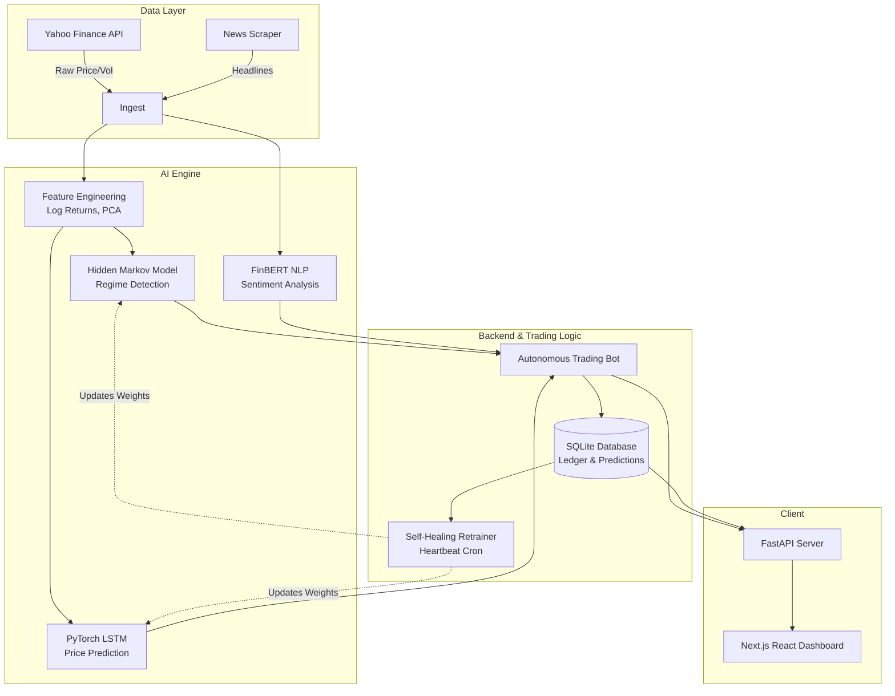

# Latent Regime Discovery & Autonomous Quantitative Hedge Fund


An institutional-grade, fully autonomous quantitative trading platform. This project uses **Unsupervised Machine Learning** to detect hidden macroeconomic market states, **Deep Learning** to predict price action, and **Natural Language Processing (LLMs)** to analyze live news sentiment. 

It manages a simulated $10,000 multi-asset portfolio autonomously, dynamically hedging cash based on mathematical risk, and includes a "self-healing" script to automatically retrain its neural networks if accuracy drops.

---

## 🧠 Core Architecture



The "Brain" of this platform is divided into three distinct AI models operating in tandem:

1. **The Macro Analyst (Hidden Markov Model & PCA):**
   - Ingests chaotic market data (volatility, momentum, log returns).
   - Uses Principal Component Analysis (PCA) to reduce dimensionality and eliminate multicollinearity.
   - Uses an unsupervised Hidden Markov Model (HMM) to cluster data into 3 Latent Regimes (Bull, Bear, Sideways) to determine mathematical market safety.

2. **The Price Predictor (PyTorch LSTM):**
   - A Long Short-Term Memory (LSTM) neural network that processes 21-day rolling sequences of historical data.
   - Learns via Backpropagation Through Time (BPTT) to predict tomorrow's exact closing price.

3. **The Fundamental Analyst (FinBERT NLP):**
   - A transformer-based Large Language Model fine-tuned on financial text.
   - Scrapes live Yahoo Finance news and calculates a mathematical sentiment score (Positive/Negative/Neutral) to contextualize the numbers.

---

## ⚡ Key Features

- **Multi-Asset Support:** Currently tracks and models `^GSPC` (S&P 500), `NVDA`, `TSLA`, `BTC-USD`, and `BRK-B`.
- **Autonomous Paper Trading Bot:** A background engine that dynamically allocates a virtual $10,000 bankroll based on HMM regime safety.
- **Self-Healing Auto-Retrainer:** A heartbeat script that tracks the 7-day rolling Mean Absolute Error (MAE) of the LSTM's predictions vs reality. If the error exceeds 5%, it automatically triggers a PyTorch retraining session to adapt to new market conditions.
- **Live Next.js Dashboard:** A beautiful frontend visualizing the AI's internal state, regime probabilities, historical backtest results, and live portfolio ledger.
- **Dockerized:** Fully containerized for 1-click cloud deployment.

---

## 🚀 Quickstart (Local Development)

### 1. Backend Setup
```bash
# Clone the repo
git clone https://github.com/yourusername/latent-regime-discovery.git
cd latent-regime-discovery

# Create a virtual environment
python -m venv .venv
source .venv/bin/activate  # Or .venv\Scripts\activate on Windows

# Install Python dependencies
pip install -r requirements.txt

# Seed the database and pre-train the models
python src/bot/seed_bot.py

# Start the FastAPI server
uvicorn src.api.server:app --reload --port 8000
```

### 2. Frontend Setup
Open a new terminal window:
```bash
cd frontend

# Install Node dependencies
npm install

# Start the Next.js development server
npm run dev
```
Navigate to `http://localhost:3000` to view the live dashboard.

---

## 🐳 Deployment (Docker / Azure)

This platform is production-ready and can be deployed to any cloud provider (AWS, Azure, DigitalOcean) using Docker Compose.

1. Provision a Linux Virtual Machine (e.g., Azure Standard_B2s).
2. Install Docker and Docker Compose on the VM.
3. Clone this repository onto the VM.
4. Run the orchestration command:
```bash
sudo docker-compose up -d --build
```

This spins up 3 interconnected containers:
- `api-server`: The Python FastAPI backend (Port 8000).
- `web-ui`: The Next.js dashboard (Port 3000).
- `scheduler`: An invisible Python container acting as a heartbeat, pinging the backend exactly at 4:15 PM EST every day to trigger the daily trading cycle and check for required neural network retraining.

---

## 📂 Project Structure

```text
/
├── src/
│   ├── api/          # FastAPI web server and endpoints
│   ├── bot/          # Paper Trading logic, SQLite database, and Auto-Retrainer
│   ├── data/         # Data ingestion (yfinance) and cleaning scripts
│   ├── features/     # Feature engineering (Log Returns, Volatility, PCA)
│   └── models/       # PyTorch LSTM, HMM implementation, FinBERT NLP
├── frontend/         # Next.js React Dashboard (UI Components, Tailwind)
├── docker-compose.yml# Multi-container orchestration
├── Dockerfile.backend# Python backend container build instructions
└── Dockerfile.scheduler # Autonomous heartbeat container build instructions
```

---

## ⚠️ Disclaimer

**This project is strictly for educational, research, and software engineering demonstration purposes.** It is not financial advice. The models built in this repository are highly simplified and do not account for slippage, liquidity crises, exchange fees, or other real-world market mechanics. Do not use this code to trade real money.
